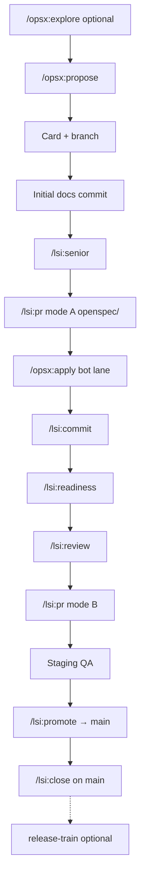

LSI workflow discovery — one response per invocation. Read-only reference; no implementation side effects.

**Canonical source:** [which-workflow.md](../../docs/workflows/which-workflow.md) · [openspec-git-integration.md](../../overlays/lsi/docs/workflows/openspec-git-integration.md)

**One-shot help guardrails**

- **One response per invocation:** no multi-turn help state; do not treat later messages as help navigation unless the user runs `/lsi:help` again.
- **Topic arg required for content:** when `<topic>` is provided, **read this file**, find `## Section: \`{topic}\``, substitute `{ref}`, and **emit the full section in chat** (optional one-line intro only).
- **No menu after topic:** after rendering a section, stop — do not re-show the topic list.
- **Read-only:** no `git commit`, `git ts`, `git tb`, Trello API, `adopt.py`, or running other `/lsi:*` / `/opsx:*`.
- **Suggest, don't run:** the `next` topic names one command + rationale only — never auto-invoke it.
- **No dump:** on no-arg invocation, never emit section bodies — overview + topic list only.

**Input:** Optional topic — `lifecycle`, `sdlc`, `status`, `commands`, `policies`, `overlap`, `links`, `next`, `bot-sessions`.

**Steps**

1. Read `PROJECT.md` → `{ref}` = `v{BUNDLE_VERSION}` when present, else `main`.
2. **If `<topic>` arg:** run read-only git/openspec when topic is `status` or `next`; locate `## Section: \`{topic}\`` in this file; substitute `{ref}`; emit full section in chat; stop.
3. **If no arg:** emit overview template + numbered topic list; stop.
4. **Invalid topic:** one-line error + numbered topic list (still one response).

**Topic list**

| # | id | label | invoke |
|---|-----|-------|--------|
| 1 | `sdlc` | SDLC diagram | `/lsi:help sdlc` |
| 2 | `lifecycle` | Full lifecycle + bot sessions | `/lsi:help lifecycle` |
| 3 | `status` | Where you are now | `/lsi:help status` |
| 4 | `commands` | Command reference by phase | `/lsi:help commands` |
| 5 | `policies` | Key policies | `/lsi:help policies` |
| 6 | `overlap` | Overlap rules and card paths | `/lsi:help overlap` |
| 7 | `links` | Deep dive spec links | `/lsi:help links` |
| 8 | `next` | Suggested next command | `/lsi:help next` |
| 9 | `bot-sessions` | Unattended PR / apply bots | `/lsi:help bot-sessions` |

---

## GitHub URL builder

All spec links in help output:

`https://github.com/osuarez1/cursor-dev-workflows/blob/{ref}/{bundle-path}`

Replace `{ref}` from step 1. Example:

`[senior-analysis.md](https://github.com/osuarez1/cursor-dev-workflows/blob/v1.4.1/docs/workflows/senior-analysis.md)`

**Bundle-path map**

| Label | bundle-path |
|-------|-------------|
| which-workflow.md | `overlays/lsi/docs/workflows/which-workflow.md` |
| openspec-git-integration.md | `overlays/lsi/docs/workflows/openspec-git-integration.md` |
| branch-workflow.md | `overlays/lsi/docs/workflows/branch-workflow.md` |
| git-trello.md | `overlays/lsi/docs/sdlc/git-trello.md` |
| ticket-card-info.md | `docs/workflows/ticket-card-info.md` |
| pull-requests.md | `docs/workflows/pull-requests.md` |
| pr-production-readiness.md | `docs/workflows/pr-production-readiness.md` |
| code-review.md | `docs/workflows/code-review.md` |
| senior-analysis.md | `docs/workflows/senior-analysis.md` |
| commits-logical-order.md | `docs/workflows/commits-logical-order.md` |
| versioning-and-releases.md | `overlays/lsi/docs/workflows/versioning-and-releases.md` |
| adopt-and-update.md | `docs/adopt-and-update.md` |
| common-mistakes.md | `docs/workflows/common-mistakes.md` |
| test-requirements.md | `docs/workflows/test-requirements.md` |
| integrations.md | `docs/workflows/integrations.md` |
| CONVENTION.commits.template | `overlays/lsi/agent-stack/CONVENTION.commits.template` |

Do **not** use relative `.lsi/workflows/` paths or adopter Bitbucket URLs in help output.

---

## Overview template (no-arg invocation only)

```markdown
## LSI workflow overview

- **Dual ticketing:** OpenSpec + Trello (24-char branch id) — staging-first to `main`
- **Typical path:** propose → card/branch → apply → commit → readiness/review → PR → promote → close
- **Bundle:** [cursor-dev-workflows](https://github.com/osuarez1/cursor-dev-workflows) @ `{ref}`

Run `/lsi:help <topic>` for a section (see topic list below).
```

Optional one-line context hint (branch / phase) after the overview.

---

## Section: `sdlc`

When topic is `sdlc`, emit this entire block in the chat response (substitute `{ref}`).

Emit **mermaid only** (no numbered lifecycle list):



Legend: human lane through Mode A; bot lane apply→Mode B; promote then **`/lsi:close` on `main`**; dashed = optional release on `main`.

Link to [which-workflow.md](https://github.com/osuarez1/cursor-dev-workflows/blob/{ref}/overlays/lsi/docs/workflows/which-workflow.md) for **routing** flowchart (ambiguous requests — different from this SDLC diagram).

---

## Section: `lifecycle`

When topic is `lifecycle`, emit this entire block in the chat response (substitute `{ref}`).

Human / bot / promote lanes (GitHub links inline) — full detail in [openspec-git-integration.md](https://github.com/osuarez1/cursor-dev-workflows/blob/{ref}/overlays/lsi/docs/workflows/openspec-git-integration.md) and [bot-lane.md](https://github.com/osuarez1/cursor-dev-workflows/blob/{ref}/overlays/lsi/agent-stack/bot-lane.md):

**Human 1–8:** explore → propose → card/branch → initial docs commit → senior → Mode **A** PR (`openspec/` only) → optional **`/lsi:pr-bot-docs`** → merge-desc  
**Bot 9–19:** **`/lsi:apply-bot`** (or manual apply → gates → Mode **B** PR) → optional **`/lsi:pr-bot`** → merge-desc  
**Human 20–24:** staging QA → `/lsi:promote` → merge-desc → **`/lsi:close` on `main`** → optional release-train on **`main`**  


PR modes: **A** = `openspec/` only; **B** = implementation; **C** = tiny single PR (opt-in, `PR_WARN_*` / `PR_MAX_*`).

Bot sessions detail: `/lsi:help bot-sessions`.

---

## Section: `bot-sessions`

When topic is `bot-sessions`, emit this entire block in the chat response (substitute `{ref}`).

Unattended Bitbucket sessions (require `PR_HOST` = Bitbucket, `.lsi/bin/lsi-bitbucket`, `BB_*` secrets):

| Command | When |
|---------|------|
| `/lsi:pr-bot-docs <PR> [--fix]` | Mode A (`openspec/`-only) PR — senior Deep + plan-gap |
| `/lsi:apply-bot <slug>` | After Mode A merge — apply + gates + Mode B PR |
| `/lsi:pr-bot <PR> [--fix]` | Mode B PR — verify/readiness/review loops + QA plan |

Skeleton: [bot-sessions.md](https://github.com/osuarez1/cursor-dev-workflows/blob/{ref}/overlays/lsi/agent-stack/bot-sessions.md). Credentials + authorization: [integrations.md](https://github.com/osuarez1/cursor-dev-workflows/blob/{ref}/docs/workflows/integrations.md).

---

## Section: `status`

When topic is `status`, emit this entire block in the chat response (substitute `{ref}`). Run read-only inputs first.

**Read-only inputs:** `git branch --show-current`, `openspec list --json`; optional `git status --short`, check `design.md` / unchecked `tasks.md`.

**Branch classification**

| Pattern | Match |
|---------|--------|
| Protected integration | `^(main\|staging)$` |
| Ticket-linked | `^(feature\|bugfix\|hotfix\|chore)/[a-f0-9]{24}-.+$` |
| Other | Non-ticket or legacy branch names |

Extract `{id}` and `{change-slug}` from ticket branch. Compare `{change-slug}` to active OpenSpec change when one is in progress.

**Phase → suggested command** (first matching row wins):

| Branch class | OpenSpec / signals | Phase label | Suggested command |
|--------------|-------------------|-------------|-------------------|
| Other | Active change; branch lacks 24-char id | Wrong branch | `/lsi:branch` — then `/lsi:card-link` if on feature work without id |
| Protected | No in-progress change | Pre-change | `/opsx:explore` (optional) or `/opsx:propose` |
| Protected | In-progress; `design.md` present; apply not started | Design review (optional) | `/lsi:senior` — then card setup |
| Protected | In-progress; ready for card | Card setup | `/lsi:card` from `main`/`staging` — or `/lsi:trello-list` → branch for existing card |
| Ticket | Suffix ≠ active change slug | Branch mismatch | `/lsi:branch` |
| Ticket | `tasks.md` has unchecked apply items | Implement | `/opsx:apply` |
| Ticket | Uncommitted changes; user likely committing | Commit | `/lsi:commit` (only when user asks to commit) |
| Ticket | Apply complete; pre-PR | Readiness | `/lsi:readiness` |
| Ticket | After readiness pass | Review | `/lsi:review` |
| Ticket | After review; Mode A or B ready | PR to staging | `/lsi:pr` (mode A or B) |
| Ticket / `staging` | After staging QA; change still active | Promotion | `/lsi:promote` — staging QA confirmed; do not close yet |
| Protected `main` | After promotion merge | Close + merge desc | `/lsi:merge-desc` then `/lsi:close` on **`main`** |
| Protected `main` | After close | Optional release | `/lsi:release-train` (or version → changelog → release) |

**Ambiguity:** prefer earlier lifecycle step; when staging merge / promotion / close cannot be inferred, say **phase unclear** and suggest **`/lsi:help lifecycle`** or **`/lsi:branch`** — do not guess.

**Output:** branch class, active OpenSpec, inferred phase label, suggested next command + one-line why.

**Conditional `TITLE_PREFIX` note:** when suggested next step is card setup (`/lsi:card`, `/lsi:card-link`, `/lsi:trello-list` → branch), add: read `TITLE_PREFIX` from `PROJECT.md` for card titles; when absent, use `REPO_NAME |` per [ticket-card-info.md](https://github.com/osuarez1/cursor-dev-workflows/blob/{ref}/docs/workflows/ticket-card-info.md). Do **not** emit this note on other phases.

---

## Section: `next`

When topic is `next`, emit this entire block in the chat response (substitute `{ref}`). Run read-only inputs first (same heuristics as `status`).

Apply the branch → phase → command table from **`status`** (same inputs and rows). **Output:** one `/lsi:*` or `/opsx:*` + rationale only — **never invoke**.

---

## Section: `commands`

When topic is `commands`, emit this entire block in the chat response (substitute `{ref}`).

| Phase | Command | Spec |
|-------|---------|------|
| Explore | `/opsx:explore` | [openspec-git-integration.md](https://github.com/osuarez1/cursor-dev-workflows/blob/{ref}/overlays/lsi/docs/workflows/openspec-git-integration.md) |
| Propose | `/opsx:propose` | [openspec-git-integration.md](https://github.com/osuarez1/cursor-dev-workflows/blob/{ref}/overlays/lsi/docs/workflows/openspec-git-integration.md) |
| Senior analysis | `/lsi:senior` | [senior-analysis.md](https://github.com/osuarez1/cursor-dev-workflows/blob/{ref}/docs/workflows/senior-analysis.md) |
| Card + branch | `/lsi:card` | [ticket-card-info.md](https://github.com/osuarez1/cursor-dev-workflows/blob/{ref}/docs/workflows/ticket-card-info.md) |
| Link existing branch | `/lsi:card-link` | [openspec-git-integration.md](https://github.com/osuarez1/cursor-dev-workflows/blob/{ref}/overlays/lsi/docs/workflows/openspec-git-integration.md) |
| List / branch from To Do | `/lsi:trello-list`, `/lsi:trello-branch` | [git-trello.md](https://github.com/osuarez1/cursor-dev-workflows/blob/{ref}/overlays/lsi/docs/sdlc/git-trello.md) |
| Branch verify | `/lsi:branch` | [branch-workflow.md](https://github.com/osuarez1/cursor-dev-workflows/blob/{ref}/overlays/lsi/docs/workflows/branch-workflow.md) |
| Implement | `/opsx:apply` | [openspec-git-integration.md](https://github.com/osuarez1/cursor-dev-workflows/blob/{ref}/overlays/lsi/docs/workflows/openspec-git-integration.md) |
| Commit | `/lsi:commit` | [commits-logical-order.md](https://github.com/osuarez1/cursor-dev-workflows/blob/{ref}/docs/workflows/commits-logical-order.md) |
| Readiness | `/lsi:readiness` | [pr-production-readiness.md](https://github.com/osuarez1/cursor-dev-workflows/blob/{ref}/docs/workflows/pr-production-readiness.md) |
| Review | `/lsi:review` | [code-review.md](https://github.com/osuarez1/cursor-dev-workflows/blob/{ref}/docs/workflows/code-review.md) |
| Bot sessions | `/lsi:pr-bot`, `/lsi:pr-bot-docs`, `/lsi:apply-bot` | [integrations.md](https://github.com/osuarez1/cursor-dev-workflows/blob/{ref}/docs/workflows/integrations.md) · bot-sessions |
| PR | `/lsi:pr` | [pull-requests.md](https://github.com/osuarez1/cursor-dev-workflows/blob/{ref}/docs/workflows/pull-requests.md) |
| Merge desc | `/lsi:merge-desc` | [openspec-git-integration.md](https://github.com/osuarez1/cursor-dev-workflows/blob/{ref}/overlays/lsi/docs/workflows/openspec-git-integration.md) |
| Promote | `/lsi:promote` | [pull-requests.md](https://github.com/osuarez1/cursor-dev-workflows/blob/{ref}/docs/workflows/pull-requests.md) |
| Close (after promote, on main) | `/lsi:close` | [openspec-git-integration.md](https://github.com/osuarez1/cursor-dev-workflows/blob/{ref}/overlays/lsi/docs/workflows/openspec-git-integration.md) |
| Address findings | `/lsi:address-senior`, `/lsi:address-review`, `/lsi:address-verify`, `/lsi:address-readiness`, `/lsi:address-prowler` | bot-lane / prompt library |
| Release | `/lsi:version`, `/lsi:changelog`, `/lsi:release`, `/lsi:release-train` | [versioning-and-releases.md](https://github.com/osuarez1/cursor-dev-workflows/blob/{ref}/overlays/lsi/docs/workflows/versioning-and-releases.md) |
| Re-sync bundle | `/lsi:update` | [adopt-and-update.md](https://github.com/osuarez1/cursor-dev-workflows/blob/{ref}/docs/adopt-and-update.md) |
| Workflow help | `/lsi:help` | [lsi-help.md](https://github.com/osuarez1/cursor-dev-workflows/blob/{ref}/overlays/lsi/agent-stack/commands/lsi-help.md) |

**OpenSpec:** `/opsx:sync`, `/opsx:archive` — via `/lsi:close` on **`main`** after the promotion PR merges.

---

## Section: `policies`

When topic is `policies`, emit this entire block in the chat response (substitute `{ref}`).

- **Protected branches** — no task work on `main`/`staging` except card-setup commands — [branch-workflow.md](https://github.com/osuarez1/cursor-dev-workflows/blob/{ref}/overlays/lsi/docs/workflows/branch-workflow.md)
- **Ticket branch pattern** — `feature|bugfix|hotfix|chore/{24-char-id}-<change-slug>` — [openspec-git-integration.md](https://github.com/osuarez1/cursor-dev-workflows/blob/{ref}/overlays/lsi/docs/workflows/openspec-git-integration.md)
- **Staging-first PRs** — feature PRs target **`staging`**; promotion targets **`main`**
- **No sync/archive on staging merge** — keep change active through promote; `/lsi:close` on **`main`** after the promotion PR merges
- **PR modes A/B/C** — A = `openspec/` only; B = implementation; C = tiny opt-in with `PR_WARN_*` / `PR_MAX_*`
- **No Next footers** on slash commands — sequencing in lifecycle / [bot-lane.md](https://github.com/osuarez1/cursor-dev-workflows/blob/{ref}/overlays/lsi/agent-stack/bot-lane.md)
- **Commit only when asked** — show plan first — [commits-logical-order.md](https://github.com/osuarez1/cursor-dev-workflows/blob/{ref}/docs/workflows/commits-logical-order.md)
- **Readiness / review before PR** — run as separate commands; `/lsi:pr` does not chain them — [pr-production-readiness.md](https://github.com/osuarez1/cursor-dev-workflows/blob/{ref}/docs/workflows/pr-production-readiness.md), [code-review.md](https://github.com/osuarez1/cursor-dev-workflows/blob/{ref}/docs/workflows/code-review.md)
- **Card copy redacted** before Trello API — [git-trello.md](https://github.com/osuarez1/cursor-dev-workflows/blob/{ref}/overlays/lsi/docs/sdlc/git-trello.md)
- **Tests** — [test-requirements.md](https://github.com/osuarez1/cursor-dev-workflows/blob/{ref}/docs/workflows/test-requirements.md)

---

## Section: `overlap`

When topic is `overlap`, emit this entire block in the chat response (substitute `{ref}`).

Summarize overlay [which-workflow.md](https://github.com/osuarez1/cursor-dev-workflows/blob/{ref}/overlays/lsi/docs/workflows/which-workflow.md) overlap rules:

1. **PR conventions vs readiness vs code review** — format vs checklist vs deep review; readiness before PR, review before merge.
2. **Senior analysis vs code review** — design alternatives ≠ security/performance gates; different verdict words.
3. **Bot session vs standalone review** — `/lsi:pr-bot*` / `/lsi:apply-bot` authorize one PR/change that session; standalone defaults unchanged.
4. **Ticket card vs implementation** — card drafting does not authorize coding on protected branches.
5. **`/lsi:card` vs `/lsi:card-link` vs trello commands** — new card (`git ts`) vs link existing vs picker → `git tb`.
6. **Commit plan vs commit execution** — plan first; `git commit` only when user asks (bot: helper).
7. **`tasks.md` vs close** — `/opsx:apply` completes tasks only; `/lsi:close` on **`main`** after the promotion PR merges.
8. **`/lsi:help` vs implementation commands** — read-only reference output (one response per invocation); may suggest the next command but does **not** run `/lsi:*`, `/opsx:*`, `git ts`/`git tb`, Trello API, `adopt.py`, or commits. When the user wants to **do** work, use the implementation command. Detail: [lsi-help.md](https://github.com/osuarez1/cursor-dev-workflows/blob/{ref}/overlays/lsi/agent-stack/commands/lsi-help.md).

---

## Section: `links`

When topic is `links`, emit this entire block in the chat response (substitute `{ref}`).

Bullet list — all bundle-path map entries as GitHub blob links (use `{ref}` from step 1).
