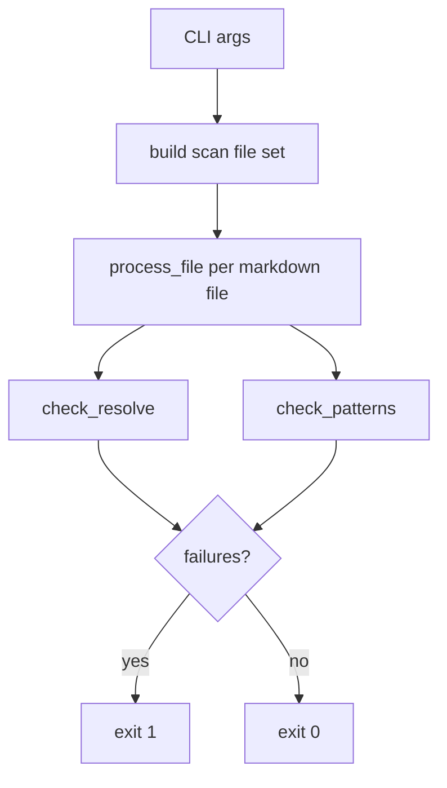

# Adoption link verification architecture

Design reference for the adoption link verification gate. Operator steps: [adoption-layout.md](adoption-layout.md) and [adoption-checklist.md](../adoption-checklist.md).

## Purpose

After **`snippets/adopt.py`** installs workflow docs under **`.lsi/workflows/`**, markdown links must resolve and layout anti-patterns must not appear. The verification gate runs **before merge** on adoption and re-sync PRs.

| Role | Artifact |
|------|----------|
| Operator guide | [adoption-layout.md](adoption-layout.md) — LSI layout, CLI examples |
| Checklist gate | [adoption-checklist.md](../adoption-checklist.md) — required verify step |
| Implementation | [snippets/adoption-verify-links.py](../snippets/adoption-verify-links.py) |
| Adopt link regression | [snippets/test_adopt_links.py](../snippets/test_adopt_links.py) — temp adopt + verify (bundle gate); one test calls ``adopt(..., skip_audit=True)`` for the built-in post-adopt verify hook; others call helpers + ``verify()`` directly for ``extra_dirs`` scopes |
| Fixture regression | [snippets/test_adoption_verify_links.py](../snippets/test_adoption_verify_links.py) |
| Source grep (manual pre-PR) | [snippets/check-workflow-link-sources.py](../snippets/check-workflow-link-sources.py) |
| Adopter-shaped sources | [overlays/lsi/adopter-docs/](../overlays/lsi/adopter-docs/) — when maintainer layout diverges |

Legacy Profile A/B scan modes were **retired in v1.3.0** — the script targets the LSI layout only.

## Three-tier link policy (adopt output)

| Tier | When | Link style |
|------|------|------------|
| **1 — Installed** | Target exists in adopter repo after adopt | Relative path from containing file |
| **2 — Maintainer-only** | Never copied to adopter (`patches/`, bundle `overlays/lsi/…`) | GitHub blob URL with `v{{BUNDLE_VERSION}}` or prose |
| **3 — Copy extras** | Small artifact copied during adopt (e.g. CI snippets) | Copy in `adopt.py`, then tier 1 relative link |

Authoring: [overlays/lsi/adopter-docs/README.md](../overlays/lsi/adopter-docs/README.md). Fix links at source — `LINK_REWRITES` in `adopt.py` are a transition aid only.

Tier 3: both `docs/ci/check_version-*.yml` copy to `.lsi/workflows/ci/` on every adopt.

## Components



1. **Build scan set** — Collect markdown under `CANONICAL_DOCS_PATH` (default `.lsi/workflows/`), root entry points, and optional `--extra-dirs`.
2. **Process file** — Single read per file; extract `](href)` links and run checks.
3. **Exit** — Non-zero if any broken link or pattern violation; warnings alone do not fail.

## Scan model (LSI layout)

| Source | Included when |
|--------|----------------|
| `CANONICAL_DOCS_PATH/**/*.md` | Always (default: `.lsi/workflows/`) |
| Root `AGENTS.md` | File exists |
| Root `README.md` | File exists |
| `--extra-dirs` paths | When directory exists |

If `which-workflow.md` is missing under `CANONICAL_DOCS_PATH`, the script prints a **warning** (non-fatal) to stderr.

`templates/` and `examples/` live **inside** `.lsi/workflows/` after adopt — scanned via the canonical tree, not as separate root dirs.

## Check types

### Link resolution

- Regex: `](href)` in markdown (not images distinguished; same pattern).
- Skips: `http://`, `https://`, `mailto:`, anchor-only `](#section)`.
- Resolves relative to the containing file; target must exist on disk.
- Target must stay **inside** `--repo-root` after `.resolve()`.

### Pattern rules

| Pattern | When flagged |
|---------|----------------|
| `](docs/workflows/` inside `CANONICAL_DOCS_PATH` | Always (doubled prefix) |
| `](overlays/lsi/` inside `CANONICAL_DOCS_PATH` | Always (tier 2 smuggled as relative) |
| `](agent-stack/` inside `CANONICAL_DOCS_PATH` | Always (tier 2 smuggled as relative) |

### Not checked

- Anchor ID existence (`#heading` targets)
- External URL reachability
- `.cursor/rules/*.mdc` or other non-`.md` files
- Placeholder tokens (`CANONICAL_DOCS_PATH`, etc.)

## CLI reference

Run from the **application repo root** (or pass `--repo-root`).

| Flag | Default | Purpose |
|------|---------|---------|
| `--repo-root` | `.` | Application repository root |
| `--canonical` | `.lsi/workflows` | `CANONICAL_DOCS_PATH` relative to repo root |
| `--extra-dirs PATH` | none (repeatable) | Scan additional directory trees |

**Example:**

```bash
python3 snippets/adoption-verify-links.py \
  --repo-root . \
  --canonical .lsi/workflows
```

Exit code `0` = pass; non-zero prints `PATTERN VIOLATIONS` and/or `BROKEN LINKS` to stderr.

## Extension points

### New pattern rules

Add a compiled regex and a branch in `check_patterns()` in [adoption-verify-links.py](../snippets/adoption-verify-links.py). Document the rule here and in [adoption-layout.md](adoption-layout.md). Add a fixture under [snippets/fixtures/adoption-verify/](../snippets/fixtures/adoption-verify/) and a test case.

### When to use `--extra-dirs`

Use when additional markdown trees outside `.lsi/workflows/` must participate in link checks (rare — prefer keeping adopt-managed docs under the canonical path).

## Tests

Fixtures live under [snippets/fixtures/adoption-verify/](../snippets/fixtures/adoption-verify/):

| Fixture | Asserts |
|---------|---------|
| `lsi-pass/` | Clean LSI layout |
| `lsi-broken-router/` | Broken link in `.lsi/workflows/which-workflow.md` |
| `lsi-broken-agents/` | Broken link in root `AGENTS.md` |
| `lsi-doubled-prefix/` | Doubled `docs/workflows/` prefix inside canonical |
| `lsi-extra-dirs-pass/` | Sibling dir via `--extra-dirs` |
| `lsi-maintainer-path/` | Tier 2 maintainer paths inside canonical tree |
| `out-of-repo-link/` | Href escapes repo root |

Run (required before any bundle `VERSION` bump):

```bash
python3 snippets/test_adoption_verify_links.py
python3 snippets/test_adopt_links.py
python3 snippets/check-workflow-link-sources.py   # manual pre-PR until CI
```

``test_adopt_links.py`` uses helper calls plus direct ``verify()`` for most cases so bundle-only ``--extra-dirs`` scans stay explicit. One integration test calls ``adopt(..., skip_audit=True)`` to exercise the full adopt entry point and its post-adopt verify subprocess.

**When bundle CI lands:** run all three in the same job on every PR; block merge on failure.

Maintainers: include in pre-release checklist ([MAINTAINER.md.example](../MAINTAINER.md.example)).

## Related

- [adoption-layout.md](adoption-layout.md) — LSI layout and adopter how-to
- [adoption-checklist.md](../adoption-checklist.md) — bootstrap checklist
- [docs/versioning.md](versioning.md) — re-sync policy
