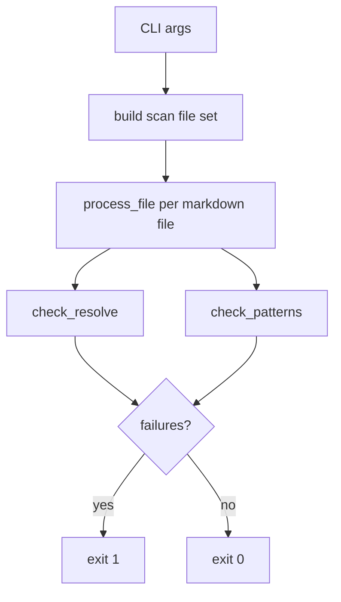

# Adoption link verification architecture

Design reference for the adoption link verification gate. Operator steps: [adoption-layout.md](adoption-layout.md) and [adoption-checklist.md §9](../adoption-checklist.md).

## Purpose

After copying **cursor-dev-workflows** into an application repository, markdown links must resolve and layout-specific anti-patterns must not appear. The verification gate runs **before merge** on adoption and re-sync PRs.

| Role | Artifact |
|------|----------|
| Operator guide | [adoption-layout.md](adoption-layout.md) — profiles, copy map, CLI examples |
| Checklist gate | [adoption-checklist.md §9](../adoption-checklist.md) — required step |
| Implementation | [snippets/adoption-verify-links.py](../snippets/adoption-verify-links.py) |
| Regression tests | [snippets/test_adoption_verify_links.py](../snippets/test_adoption_verify_links.py) |

## Components



1. **Build scan set** — Collect markdown files from `CANONICAL_DOCS_PATH`, profile-specific roots, optional `--extra-dirs`, and Profile A entry points.
2. **Process file** — Single read per file; extract `](href)` links and run checks.
3. **Exit** — Non-zero if any broken link or pattern violation; warnings alone do not fail.

## Scan model

### Profile A (mirror bundle)

| Source | Included when |
|--------|----------------|
| `CANONICAL_DOCS_PATH/**/*.md` | Always |
| Root `which-workflow.md` | File exists |
| Root `AGENTS.md` | File exists |
| Root `README.md` | File exists |
| Root `templates/**/*.md` | Default; skipped with `--no-support-dirs` |
| Root `examples/**/*.md` | Default; skipped with `--no-support-dirs` |
| `--extra-dirs` paths | When directory exists |

If Profile A is selected and root `which-workflow.md` is missing, the script prints a **warning** (non-fatal) to stderr.

### Profile B (flatten)

| Source | Included when |
|--------|----------------|
| `CANONICAL_DOCS_PATH/**/*.md` | Always (router lives here) |
| Root `templates/` / `examples/` | **Never** scanned by default |
| `--extra-dirs` paths | When directory exists (sibling templates/examples) |

## Check types

### Link resolution

- Regex: `](href)` in markdown (not images distinguished; same pattern).
- Skips: `http://`, `https://`, `mailto:`, anchor-only `](#section)`.
- Resolves relative to the containing file; target must exist on disk.
- Target must stay **inside** `--repo-root` after `.resolve()`.

### Pattern rules

| Pattern | When flagged |
|---------|----------------|
| `](docs/workflows/` inside `CANONICAL_DOCS_PATH` | Always (doubled prefix) |
| `](../docs/workflows/` inside `CANONICAL_DOCS_PATH` | Profile **B** only |

### Not checked

- Anchor ID existence (`#heading` targets)
- External URL reachability
- `.cursor/rules/*.mdc` or other non-`.md` files
- Placeholder tokens (`CANONICAL_DOCS_PATH`, etc.)

## CLI reference

Run from the **application repo root** (or pass `--repo-root`).

| Flag | Default | Purpose |
|------|---------|---------|
| `--repo-root` | `.` | Application repository root |
| `--canonical` | `docs/workflows` | `CANONICAL_DOCS_PATH` relative to repo root |
| `--profile` | `A` | Layout profile: `A` or `B` |
| `--no-support-dirs` | off | Profile **A** only: skip root `templates/` and `examples/` |
| `--extra-dirs PATH` | none (repeatable) | Scan additional directory trees |

**Examples:**

Profile A (default):

```bash
python3 snippets/adoption-verify-links.py \
  --profile A \
  --canonical docs/workflows \
  --repo-root .
```

Profile B with sibling support dirs:

```bash
python3 snippets/adoption-verify-links.py \
  --profile B \
  --canonical docs/workflows \
  --extra-dirs docs/templates \
  --extra-dirs docs/examples \
  --repo-root .
```

Exit code `0` = pass; non-zero prints `PATTERN VIOLATIONS` and/or `BROKEN LINKS` to stderr.

## Extension points

### New pattern rules

Add a compiled regex and a branch in `check_patterns()` in [adoption-verify-links.py](../snippets/adoption-verify-links.py). Document the rule here and in [adoption-layout.md](adoption-layout.md). Add a fixture under [snippets/fixtures/adoption-verify/](../snippets/fixtures/adoption-verify/) and a test case.

### When to use `--extra-dirs`

Use when Profile B places `templates/` or `examples/` **beside** `CANONICAL_DOCS_PATH` rather than inside it. Prefer co-locating under `CANONICAL_DOCS_PATH` when possible to avoid extra flags.

Changing the default Profile A entry-point list (`which-workflow.md`, `AGENTS.md`, `README.md`) requires a script change and an architecture doc update — do not rely on `--extra-dirs` for root entry points.

## Tests

Fixtures live under [snippets/fixtures/adoption-verify/](../snippets/fixtures/adoption-verify/):

| Fixture | Asserts |
|---------|---------|
| `profile-a-pass/` | Clean Profile A layout |
| `profile-a-broken-router/` | Broken link in root router |
| `profile-a-broken-agents/` | Broken link in root `AGENTS.md` |
| `profile-b-doubled-prefix/` | Doubled `docs/workflows/` prefix |
| `out-of-repo-link/` | Href escapes repo root |
| `profile-b-extra-dirs-pass/` | Sibling dir via `--extra-dirs` |

Run:

```bash
python3 -m unittest snippets.test_adoption_verify_links -v
```

Maintainers: include in pre-release checklist ([MAINTAINER.md.example](../MAINTAINER.md.example)).

## Related

- [adoption-layout.md](adoption-layout.md) — layout profiles and adopter how-to
- [adoption-checklist.md](../adoption-checklist.md) — bootstrap checklist
- [docs/versioning.md](versioning.md) — re-sync policy
