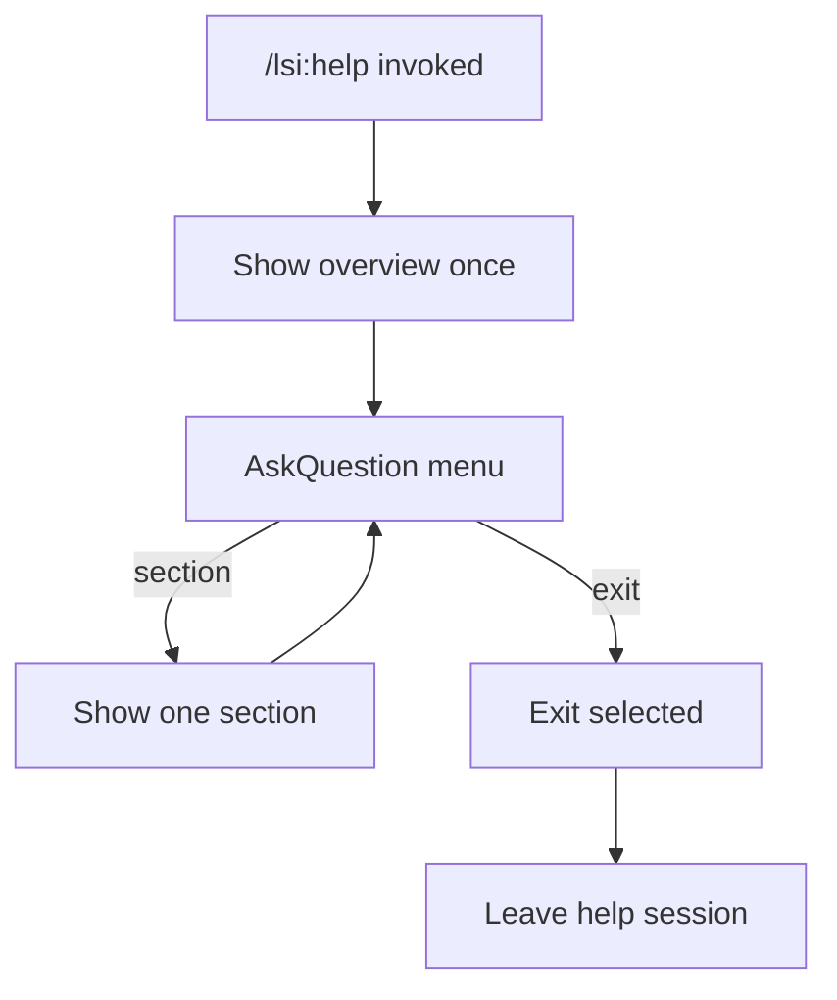
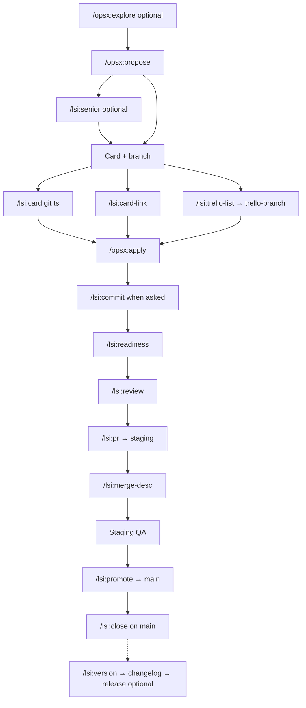

## Context

The LSI agent stack ships 18+ `/lsi:*` slash commands and adopted specs under `.lsi/workflows/`, but onboarding and “which command next?” routing rely on reading long markdown files. [`lsi-trello-list.md`](../../../overlays/lsi/agent-stack/commands/lsi-trello-list.md) already uses an **AskQuestion** picker pattern. **`/lsi:help`** applies the same interaction model to workflow discovery: short overview, menu, one section per pick, loop until Exit.

**`/lsi:ask`** (ask-before-decide gating) remains deferred — help is read-only consultation, not decision gating.

## Goals / Non-Goals

**Goals:**

- Specify interactive `/lsi:help` behavior in overlay command source (future apply).
- Overview-only first turn; detailed sections via menu.
- Mandatory re-menu after every section until Exit.
- Separate **SDLC diagram** section (mermaid) distinct from numbered lifecycle text.
- GitHub blob URLs for all bundle spec links in help output (`v{BUNDLE_VERSION}` ref).
- Normative delta spec for parity and UX scenarios.

**Non-Goals (this change):**

- Implementing `lsi-help.md` or editing bundle routers (see `tasks.md`).
- `/opsx:sync`, archive, VERSION bump, adopter re-sync.
- Bitbucket or relative `.lsi/workflows/` links in help output.
- `/lsi:ask` meta-command.

## Decisions

### 1. Help session loop (sticky until Exit)

**Choice:** From first `/lsi:help` until user picks **Exit**, treat turns as help navigation. After each section, **AskQuestion** with the same menu.

**Rationale:** Prevents one-shot dumps; user explores multiple sections without re-invoking the slash command.

**Alternative rejected:** Single response with all sections — too long; contradicts interactive goal.

### 2. Overview once per session

**Choice:** Full overview only on session start. Later loops: section content + menu (no repeated overview).

**Rationale:** Reduces noise on second and third section picks.

### 3. Nine sections + Exit

**Choice:** Menu ids: `sdlc`, `lifecycle`, `status`, `commands`, `policies`, `overlap`, `links`, `next`, `exit`.

**Rationale:** Covers SDLC visual, numbered lifecycle, context, command table, policies, overlap/card paths, deep links, and next-step routing.

### 4. SDLC diagram as separate section

**Choice:** `sdlc` section emits mermaid flowchart only (staging-first happy path). `lifecycle` section is numbered text (13 steps) without mermaid.

**Rationale:** User requested diagram as its own section; avoids duplicating visual + list in overview.

### 5. GitHub-only spec links

**Choice:** All spec links in help output use:

`https://github.com/osuarez1/cursor-dev-workflows/blob/{ref}/{bundle-path}`

where `{ref}` = `v{BUNDLE_VERSION}` from repo `PROJECT.md`, fallback `main`.

**Rationale:** Confirmed product decision — links open canonical bundle source on GitHub, not adopter Bitbucket repos or local IDE paths.

**Alternative rejected:** Relative `.lsi/workflows/` paths — not clickable outside repo; mixed clickability in examples.

### 6. Direct topic arg

**Choice:** `/lsi:help <topic>` enters session: short overview + named section + mandatory AskQuestion.

Topics: `lifecycle`, `sdlc`, `status`, `commands`, `policies`, `overlap`, `links`, `next`.

## Help session flow



### Session rules

| Rule | Detail |
|------|--------|
| Stay in help | Until **Exit** only |
| Re-menu always | After every section → AskQuestion (9 sections + Exit) |
| Overview once | Full overview on session start only |
| Read-only | No commits, Trello API, adopt, other slash commands |
| No auto-run | Do not execute `/lsi:*` or `/opsx:*` from help session |

### Follow-up text while in session

- Unambiguous text (e.g. "policies") → map to menu id → section → AskQuestion again.
- Ambiguous → AskQuestion menu (do not guess; do not exit).

## Command outline (`lsi-help.md` — future apply)

### Frontmatter

```yaml
---
name: /lsi-help
id: lsi-help
category: Workflow
description: Interactive LSI workflow help — stay in menu until Exit
---
```

### Agent steps

1. Read `PROJECT.md` → `{ref}` from `BUNDLE_VERSION`.
2. Optional read-only: `git branch --show-current`, `openspec list --json`.
3. Session start: emit overview only.
4. AskQuestion — section menu.
5. Loop until Exit: section → AskQuestion; Exit → `Exited /lsi:help.` and stop.

### Overview template

```markdown
## LSI workflow overview

- **Dual ticketing:** OpenSpec + Trello (24-char branch id) — staging-first to `main`
- **Typical path:** propose → card/branch → apply → commit → readiness/review → PR → promote → close
- **Bundle:** [cursor-dev-workflows](https://github.com/osuarez1/cursor-dev-workflows) @ `{ref}`

Pick a section below, or Exit when done.
```

Optional one-line context hint (branch / phase).

### AskQuestion menu

- **Prompt:** `What do you want to see? (Exit to leave help)`

| id | label |
|----|-------|
| `sdlc` | SDLC diagram |
| `lifecycle` | Full lifecycle (13 steps) |
| `status` | Where you are now |
| `commands` | Command reference by phase |
| `policies` | Key policies |
| `overlap` | Overlap rules and card paths |
| `links` | Deep dive spec links |
| `next` | Suggested next command |
| `exit` | Exit help |

### SDLC diagram section (`sdlc`)

Emit mermaid (staging-first feature flow):



Legend: dashed edge = optional platform release on `main`; do not sync/archive on staging merge only.

Link to [which-workflow.md](https://github.com/osuarez1/cursor-dev-workflows/blob/{ref}/overlays/lsi/docs/workflows/which-workflow.md) for **routing** flowchart (ambiguous requests — different from SDLC diagram).

### Other sections (summary)

| id | Content |
|----|---------|
| `lifecycle` | Numbered 1–13 from which-workflow § Recommended order; GitHub links inline |
| `status` | Branch, active OpenSpec, phase, suggested next command |
| `commands` | Phase table with GitHub-linked Spec column |
| `policies` | Key policies with GitHub spec links |
| `overlap` | readiness vs review vs PR; card path table |
| `links` | Bullet list of all specs from bundle-path map |
| `next` | One `/lsi:*` or `/opsx:*` + rationale |

End of every section turn: `Pick another section or Exit.` then AskQuestion.

## GitHub bundle-path map

| Label | `bundle-path` |
|-------|---------------|
| `which-workflow.md` | `overlays/lsi/docs/workflows/which-workflow.md` |
| `openspec-git-integration.md` | `overlays/lsi/docs/workflows/openspec-git-integration.md` |
| `branch-workflow.md` | `overlays/lsi/docs/workflows/branch-workflow.md` |
| `git-trello.md` | `overlays/lsi/docs/sdlc/git-trello.md` |
| `ticket-card-info.md` | `docs/workflows/ticket-card-info.md` |
| `pull-requests.md` | `docs/workflows/pull-requests.md` |
| `pr-production-readiness.md` | `docs/workflows/pr-production-readiness.md` |
| `code-review.md` | `docs/workflows/code-review.md` |
| `senior-analysis.md` | `docs/workflows/senior-analysis.md` |
| `commits-logical-order.md` | `docs/workflows/commits-logical-order.md` |
| `versioning-and-releases.md` | `overlays/lsi/docs/workflows/versioning-and-releases.md` |
| `adopt-and-update.md` | `docs/adopt-and-update.md` |
| `common-mistakes.md` | `docs/workflows/common-mistakes.md` |
| `test-requirements.md` | `docs/workflows/test-requirements.md` |
| `integrations.md` | `docs/workflows/integrations.md` |
| `CONVENTION.md` | `overlays/lsi/agent-stack/CONVENTION.commits.template` |

Example link:

`[senior-analysis.md](https://github.com/osuarez1/cursor-dev-workflows/blob/v1.4.0/docs/workflows/senior-analysis.md)`

## Risks / Trade-offs

- **AskQuestion required** — agents without AskQuestion must approximate with explicit numbered options; command guardrails should still forbid full dumps.
- **GitHub-only links** — adopters on private forks must use their fork URL manually until a `DOCS_WEB_BASE` token exists (out of scope).
- **Session state** — agent must track “in help session” across turns; new `/lsi:help` starts fresh session.
