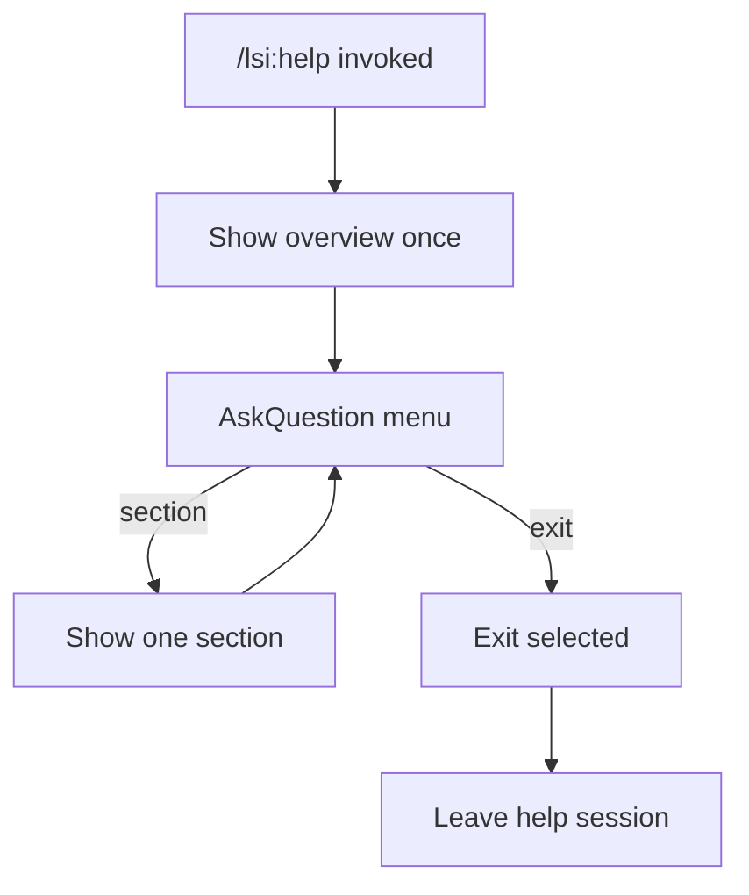
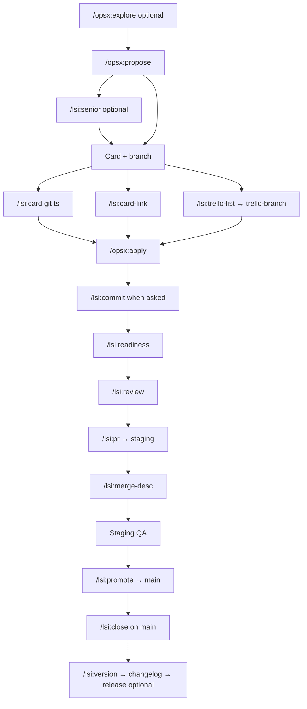

## Context

The LSI agent stack ships 18+ `/lsi:*` slash commands and adopted specs under `.lsi/workflows/`, but onboarding and “which command next?” routing rely on reading long markdown files. [`lsi-trello-list.md`](../../../overlays/lsi/agent-stack/commands/lsi-trello-list.md) already uses an **AskQuestion** picker pattern. **`/lsi:help`** applies the same interaction model to workflow discovery: short overview, menu, one section per pick, loop until Exit.

**`/lsi:ask`** (ask-before-decide gating) remains deferred — help is read-only consultation, not decision gating.

## Goals / Non-Goals

**Goals:**

- Specify interactive `/lsi:help` behavior in overlay command source (future apply).
- Overview-only first turn; detailed sections via menu.
- Mandatory re-menu after every section until Exit.
- Separate **SDLC diagram** section (mermaid) distinct from numbered lifecycle text.
- GitHub blob URLs for all bundle spec links in help output (`v{BUNDLE_VERSION}` ref).
- Normative delta spec for parity and UX scenarios.

**Non-Goals (this change):**

- Implementing `lsi-help.md` or editing bundle routers (see `tasks.md`).
- `/opsx:sync`, archive, VERSION bump, adopter re-sync.
- Bitbucket or relative `.lsi/workflows/` links in help output.
- `/lsi:ask` meta-command.

## Decisions

### 1. Help session loop (sticky until Exit)

**Choice:** From first `/lsi:help` until user picks **Exit**, treat turns as help navigation. After each section, **AskQuestion** with the same menu.

**Rationale:** Prevents one-shot dumps; user explores multiple sections without re-invoking the slash command.

**Alternative rejected:** Single response with all sections — too long; contradicts interactive goal.

### 2. Overview once per session

**Choice:** Full overview only on session start. Later loops: section content + menu (no repeated overview).

**Rationale:** Reduces noise on second and third section picks.

### 3. Nine sections + Exit

**Choice:** Menu ids: `sdlc`, `lifecycle`, `status`, `commands`, `policies`, `overlap`, `links`, `next`, `exit`.

**Rationale:** Covers SDLC visual, numbered lifecycle, context, command table, policies, overlap/card paths, deep links, and next-step routing.

### 4. SDLC diagram as separate section

**Choice:** `sdlc` section emits mermaid flowchart only (staging-first happy path). `lifecycle` section is numbered text (13 steps) without mermaid.

**Rationale:** User requested diagram as its own section; avoids duplicating visual + list in overview.

### 5. GitHub-only spec links

**Choice:** All spec links in help output use:

`https://github.com/osuarez1/cursor-dev-workflows/blob/{ref}/{bundle-path}`

where `{ref}` = `v{BUNDLE_VERSION}` from repo `PROJECT.md`, fallback `main`.

**Rationale:** Confirmed product decision — links open canonical bundle source on GitHub, not adopter Bitbucket repos or local IDE paths.

**Alternative rejected:** Relative `.lsi/workflows/` paths — not clickable outside repo; mixed clickability in examples.

### 6. Direct topic arg

**Choice:** `/lsi:help <topic>` enters session: short overview + named section + mandatory AskQuestion.

Topics: `lifecycle`, `sdlc`, `status`, `commands`, `policies`, `overlap`, `links`, `next`.

### 7. AskQuestion fallback (no refuse)

**Choice:** Prefer **AskQuestion** for the section menu. When AskQuestion is unavailable, present the same nine sections + Exit as a **numbered list** with menu ids (`sdlc`, `lifecycle`, …, `exit`) and prompt the user to **reply with the id**. Do **not** refuse or dump all sections.

**Rationale:** Keeps the session loop and read-only guardrails without hard-depending on a single Cursor tool.

**Alternative rejected:** Refuse when AskQuestion missing — blocks help in environments that still support text navigation.

### 8. Overlap rule in LSI overlay router only

**Choice:** Add overlap rule **#7** to `overlays/lsi/docs/workflows/which-workflow.md` only — not a full rule in bundle-root `which-workflow.md`. At most extend the root LSI decision-table row with “discovery → `/lsi:help` (overlay)” so maintainers know where to look.

**Suggested overlay text (one paragraph; link to `lsi-help.md` for detail):**

> **`/lsi:help` vs implementation commands** — `/lsi:help` is read-only consultation until **Exit**; it explains routing and may suggest the next command but does **not** run `/lsi:*`, `/opsx:*`, `git ts`/`git tb`, Trello API, `adopt.py`, or commits. When the user wants to **do** work (card, apply, PR, close), use the implementation command — do not substitute an ongoing help session. After **Exit**, a fresh explicit slash invocation applies.

**Rationale:** Matches existing overlay overlap rules framed as consultation vs side effects (commit plan vs execution, card vs implementation). Agents read `which-workflow.md` before picking a workflow; without this rule, routing docs and command guardrails can diverge. `/opsx:explore` stays table-only (single-turn, less sticky); `/lsi:help` justifies a dedicated rule.

**Layer ownership (avoid duplication):**

| Layer | Owns |
|-------|------|
| LSI overlay `which-workflow.md` overlap #7 | Routing disambiguation: help session ≠ implementation |
| `lsi-help.md` | Session loop, menu, section templates, no auto-run |
| Delta spec | Testable scenarios (read-only, Exit, first-turn overview) |
| Help `overlap` section | Summarize existing overlap rules + this one |

**Optional (overlay flowchart):** Early branch for “workflow help / which command / LSI onboarding” → `/lsi:help`, before the card/branch fork.

**Alternative rejected:** Full overlap rule in bundle-root `which-workflow.md` — root overlap rules are workflow-spec disambiguation (PR vs readiness vs review), not slash-command session behavior.

### 9. Status section — conditional `TITLE_PREFIX` note only

**Choice:** The **`status`** section shows branch, active OpenSpec, phase, and suggested next command. Do **not** emit a standing line about whether this repo defines `TITLE_PREFIX`. When the inferred phase or suggested next step involves **card setup** (`/lsi:card`, `/lsi:card-link`, `/lsi:trello-list` → branch), add one conditional note framed as a **token rule**: read `TITLE_PREFIX` from `PROJECT.md` for card titles; when the token is absent, use `REPO_NAME |` per [ticket-card-info.md](docs/workflows/ticket-card-info.md).

**Rationale:** `TITLE_PREFIX` is adopter-specific; help should not bake in bundle-maintainer exceptions. Card setup is the only common status turn where the token matters.

**Alternative rejected:** Always mention `TITLE_PREFIX` in status — noise on most phases; reads as bundle-specific lore instead of portable workflow guidance.

### 10. Next and status heuristics (branch → phase → command)

**Choice:** Both **`status`** and **`next`** infer phase from read-only signals, then suggest **one** slash command + short rationale. Same inference table; `status` adds branch/OpenSpec summary; `next` emits the command recommendation only.

**Inputs (read-only):**

1. `git branch --show-current`
2. `openspec list --json`
3. Optional: `git status --short`; `openspec/changes/<slug>/design.md` exists; skim `tasks.md` for unchecked boxes

**Branch classification:**

| Pattern | Match |
|---------|--------|
| Protected integration | `^(main\|staging)$` |
| Ticket-linked | `^(feature\|bugfix\|hotfix\|chore)/[a-f0-9]{24}-.+$` |
| Other | Non-ticket or legacy branch names |

Extract `{id}` and `{change-slug}` from ticket branch suffix. Compare `{change-slug}` to active OpenSpec change name when one change is in progress.

**Phase → suggested command** (first matching row wins; stop at first match):

| Branch class | OpenSpec / signals | Phase label | Suggested command |
|--------------|-------------------|-------------|-------------------|
| Other | Active change; branch lacks 24-char id | Wrong branch | `/lsi:branch` — then `/lsi:card-link` if on feature work without id |
| Protected | No in-progress change | Pre-change | `/opsx:explore` (optional) or `/opsx:propose` |
| Protected | In-progress; `design.md` present; apply not started | Design review (optional) | `/lsi:senior` — then card setup |
| Protected | In-progress; ready for card | Card setup | `/lsi:card` from `main`/`staging` — or `/lsi:trello-list` → branch for existing card |
| Ticket | Suffix ≠ active change slug | Branch mismatch | `/lsi:branch` |
| Ticket | `tasks.md` has unchecked apply items | Implement | `/opsx:apply` |
| Ticket | Uncommitted changes; user likely committing | Commit | `/lsi:commit` (only when user asks to commit) |
| Ticket | Apply complete; pre-PR | Readiness | `/lsi:readiness` |
| Ticket | After readiness pass | Review | `/lsi:review` |
| Ticket | After review; ready to open PR | PR to staging | `/lsi:pr` |
| Protected `main` | Change still in-progress after staging (infer from context) | Promotion | `/lsi:promote` — **only when user context indicates staging QA passed** |
| Protected `main` | After production merge | Production close | `/lsi:close` |

**Ambiguity rules:**

- When two rows could apply, prefer the **earlier lifecycle step** (implement before readiness).
- When staging merge / promotion / close cannot be inferred from branch + OpenSpec alone, say **phase unclear** and suggest **`lifecycle`** or **`/lsi:branch`** — do not guess promotion or close.
- **`next` never auto-runs** the suggested command; name it + one-line why only.

**Rationale:** Gives deterministic guidance without duplicating full lifecycle text; conservative on post-staging phases that need human QA context.

### 11. Decision-table row (discovery → `/lsi:help`)

**Choice:** Add a decision-table row to **LSI overlay** `which-workflow.md` and `which-workflow-lsi.md` — **yes**, placed **after `/opsx:propose`** (discovery before card/implementation). Do **not** add a full row to bundle-root `which-workflow.md`; optional one-line pointer in the existing LSI row only (see task 2.3).

**Suggested row** (same text in overlay + `which-workflow-lsi.md`):

| User says (examples) | Use | Command | Output / verdict |
|----------------------|-----|---------|------------------|
| which command, workflow help, lost, LSI onboarding, what should I run next (discovery) | [`lsi-help.md`](../../agent-stack/commands/lsi-help.md) | `/lsi:help` | Interactive overview + menu; read-only until Exit |

**Rationale:** Routes “which command / help / lost” before agents pick an implementation slash command or ask a generic clarifying question. Complements overlap rule #7 (help explains; does not run). Distinct from `/opsx:explore` (problem exploration, single-turn docs).

**Alternative rejected:** Rely on flowchart-only routing — table is what agents scan first; row is the canonical discovery entry.

## Help session flow



### Session rules

| Rule | Detail |
|------|--------|
| Stay in help | Until **Exit** only |
| Re-menu always | After every section → AskQuestion (9 sections + Exit) |
| Overview once | Full overview on session start only |
| Read-only | No commits, Trello API, adopt, other slash commands |
| No auto-run | Do not execute `/lsi:*` or `/opsx:*` from help session |

### Follow-up text while in session

- Unambiguous text (e.g. "policies") → map to menu id → section → AskQuestion again.
- Ambiguous → AskQuestion menu (do not guess; do not exit).

## Command outline (`lsi-help.md` — future apply)

### Frontmatter

```yaml
---
name: /lsi-help
id: lsi-help
category: Workflow
description: Interactive LSI workflow help — stay in menu until Exit
---
```

### Help session guardrails (required at top of `lsi-help.md`)

Place **immediately after** the one-line intro and canonical source links — **before** **Input** / **Steps**:

```markdown
**Help session — agent guardrails**

You are in a **`/lsi:help` session** until the user selects **Exit** from the section menu.

- **Stay in session:** treat follow-up turns as help navigation until Exit; do not end after one section.
- **Read-only:** no `git commit`, `git ts`, `git tb`, Trello API, `adopt.py`, or running other `/lsi:*` / `/opsx:*` from within help.
- **Suggest, don't run:** the `next` section names one command + rationale only — never auto-invoke it.
- **One section per turn:** full overview once at session start; then section content + menu only.
- **No dump:** never emit all sections, full lifecycle, command table, and SDLC diagram in one response.
- **Fresh session:** a new `/lsi:help` invocation starts over; prior session state does not carry over.
- **Menu fallback:** prefer AskQuestion; if unavailable, numbered list + reply with id (same menu ids; do not refuse).
```

### Agent steps

1. Read `PROJECT.md` → `{ref}` from `BUNDLE_VERSION`.
2. Optional read-only: `git branch --show-current`, `openspec list --json`.
3. Session start: emit overview only.
4. Section menu — **AskQuestion** when available; otherwise numbered list + “reply with id” (same ids; do not refuse).
5. Loop until Exit: section → menu again; Exit → `Exited /lsi:help.` and stop.

**`status` / `next` sections:** apply §10 branch → phase → command heuristics (read-only inputs only).

### Overview template

```markdown
## LSI workflow overview

- **Dual ticketing:** OpenSpec + Trello (24-char branch id) — staging-first to `main`
- **Typical path:** propose → card/branch → apply → commit → readiness/review → PR → promote → close
- **Bundle:** [cursor-dev-workflows](https://github.com/osuarez1/cursor-dev-workflows) @ `{ref}`

Pick a section below, or Exit when done.
```

Optional one-line context hint (branch / phase).

### AskQuestion menu

- **Prompt:** `What do you want to see? (Exit to leave help)`

| id | label |
|----|-------|
| `sdlc` | SDLC diagram |
| `lifecycle` | Full lifecycle (13 steps) |
| `status` | Where you are now |
| `commands` | Command reference by phase |
| `policies` | Key policies |
| `overlap` | Overlap rules and card paths |
| `links` | Deep dive spec links |
| `next` | Suggested next command |
| `exit` | Exit help |

### SDLC diagram section (`sdlc`)

Emit mermaid (staging-first feature flow):



Legend: dashed edge = optional platform release on `main`; do not sync/archive on staging merge only.

Link to [which-workflow.md](https://github.com/osuarez1/cursor-dev-workflows/blob/{ref}/overlays/lsi/docs/workflows/which-workflow.md) for **routing** flowchart (ambiguous requests — different from SDLC diagram).

### Other sections (summary)

| id | Content |
|----|---------|
| `lifecycle` | Numbered 1–13 from which-workflow § Recommended order; GitHub links inline |
| `status` | Branch class, active OpenSpec, inferred **phase label**, suggested next command (§10 heuristics); **conditional** `TITLE_PREFIX` token note only when card setup is suggested (§9) |
| `commands` | Phase table with GitHub-linked Spec column |
| `policies` | Key policies with GitHub spec links |
| `overlap` | readiness vs review vs PR; card paths; **`/lsi:help` vs implementation** (cite overlay overlap #7) |
| `links` | Bullet list of all specs from bundle-path map |
| `next` | One `/lsi:*` or `/opsx:*` + rationale from §10 heuristics — suggest only, never invoke |

End of every section turn: `Pick another section or Exit.` then AskQuestion.

## GitHub bundle-path map

| Label | `bundle-path` |
|-------|---------------|
| `which-workflow.md` | `overlays/lsi/docs/workflows/which-workflow.md` |
| `openspec-git-integration.md` | `overlays/lsi/docs/workflows/openspec-git-integration.md` |
| `branch-workflow.md` | `overlays/lsi/docs/workflows/branch-workflow.md` |
| `git-trello.md` | `overlays/lsi/docs/sdlc/git-trello.md` |
| `ticket-card-info.md` | `docs/workflows/ticket-card-info.md` |
| `pull-requests.md` | `docs/workflows/pull-requests.md` |
| `pr-production-readiness.md` | `docs/workflows/pr-production-readiness.md` |
| `code-review.md` | `docs/workflows/code-review.md` |
| `senior-analysis.md` | `docs/workflows/senior-analysis.md` |
| `commits-logical-order.md` | `docs/workflows/commits-logical-order.md` |
| `versioning-and-releases.md` | `overlays/lsi/docs/workflows/versioning-and-releases.md` |
| `adopt-and-update.md` | `docs/adopt-and-update.md` |
| `common-mistakes.md` | `docs/workflows/common-mistakes.md` |
| `test-requirements.md` | `docs/workflows/test-requirements.md` |
| `integrations.md` | `docs/workflows/integrations.md` |
| `CONVENTION.commits.template` | `overlays/lsi/agent-stack/CONVENTION.commits.template` (adopted into repo-root `CONVENTION.md`) |

Example link:

`[senior-analysis.md](https://github.com/osuarez1/cursor-dev-workflows/blob/v1.4.0/docs/workflows/senior-analysis.md)`

## Risks / Trade-offs

- **AskQuestion preferred** — when unavailable, use numbered menu + “reply with id”; never refuse and never dump all sections at once.
- **GitHub-only links** — adopters on private forks must use their fork URL manually until a `DOCS_WEB_BASE` token exists (out of scope).
- **Session state** — agent must track “in help session” across turns; **`lsi-help.md` opens with the help-session guardrail block** (see command outline); new `/lsi:help` starts fresh session.
