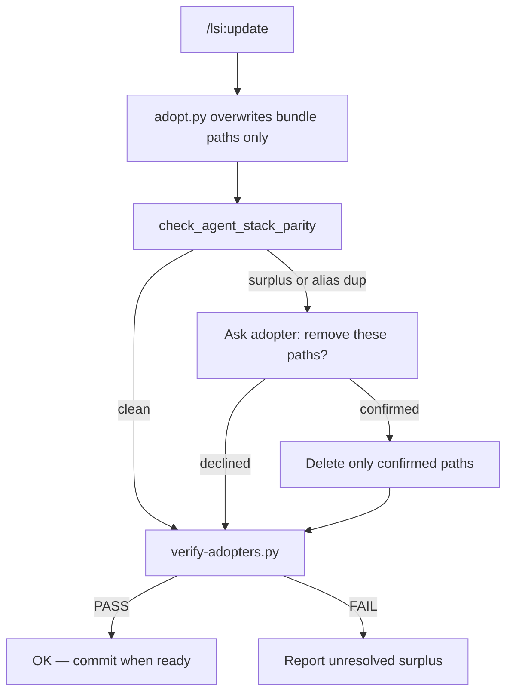

## Context

Three-layer model (from drift audit):

1. **Commands** — workflow mechanics only; tokens `{{TEST_COMMAND}}`, `{{PR_HOST}}`, etc.
2. **`.lsi/workflows/`** — generic LSI specs from bundle overlay
3. **`patches/files/<repo>/`** — domain (`openspec-git-integration.md`, `rule_overlays`)

**Drift today**

| Location | Problem |
|----------|---------|
| `web/.lsi/workflows/openspec-git-integration.md` | video-encoder title/scopes |
| `web/.cursor/commands/lsi-*.md` | FFmpeg, uv pytest, worker tables |
| Bundle `lsi-review.md`, `lsi-commit.md`, etc. | FastAPI, data-lake, frontend proxy |
| Bundle LSI `openspec-git-integration.md` | ai-agent commit mapping |
| `audit-agent-docs.py` `check_commands()` | missing only — surplus/aliases pass |

## Goals / Non-Goals

**Goals**

- Same `lsi-*.md` commands byte-identical on every adopter after adopt
- Zero forbidden agent directories after adopt
- Denylist regression tests prevent repo-specific strings in agent-stack sources
- Parity gate detects surplus/duplicate commands and rules; adopter decides removal

**Non-Goals**

- Editing adopter application repos in the bundle PR
- Supporting OpenCode / Junie / JetBrains / workflow shell wrappers

## Decisions

| # | Decision |
|---|----------|
| D1 | Delete (not deprecate) multi-tool adopt flags; adopt errors on legacy YAML keys (`agents_opencode`, `agents_junie`, `agents_jetbrains`, `bin`) |
| D2 | Commands defer to `openspec-git-integration.md` § Commit mapping / Code review — no per-repo `command_overlays` unless step flow differs |
| D3 | `rule_overlays` in `adopt.py` mirrors `command_overlays` |
| D4 | OpenSpec (`opsx-*`) commands are owned by OpenSpec (`openspec init` / config profile). The bundle ships no `opsx-*` sources; `adopt.py` installs `lsi-*` only and never installs/removes `opsx-*`; the parity gate ignores the `opsx-*` namespace. No `sync_opsx` key. |
| D5 | Pre-release gate order: `test_supported_agents_only` → `test_commands_generic` → `test_adopt_command_rule_parity` → `test_adopt_links` → temp adopts |
| D6 | Expected command/rule sets derived from bundle `overlays/lsi/agent-stack/commands/lsi-*.md` + `snippets/cursor-rules/*.md` + patch `rule_overlays` — single helper (`expected_agent_stack.py`), not three hardcoded lists |
| D7 | Gate **detects** surplus/duplicate commands and rules and **blocks verify PASS** until resolved — adopt **never silently deletes** adopter files; removal only after explicit adopter confirmation during `/lsi:update` or via pre-listed `remove_after_adopt` in patch YAML |
| D8 | Pre-listed `remove_after_adopt` in `patches/<repo>.yaml` = adopter-maintainer decision documented in patch (no per-run prompt); **interactive surplus** = gate finds unexpected extras → ask → delete only if confirmed |

## Adopt command/rule parity gate

**Two removal paths (adopter-controlled)**

| Path | When | Prompt? |
|------|------|---------|
| `remove_after_adopt` in patch YAML | Known legacy paths (e.g. `code_review.mdc`) pre-agreed in patch | No |
| Interactive surplus | Gate finds unexpected extra commands/rules or alias pairs | Yes — list each path; delete only if confirmed |

**Implementation**

1. `snippets/expected_agent_stack.py` — `expected_commands()`, `expected_rules()`, `legacy_rule_aliases()`, optional `preserve_agent_stack` globs from patch.
2. `audit-agent-docs.py` — `check_agent_stack_parity()`: missing → warn; surplus / legacy alias pair → error until resolved.
3. `adopt.py` — no auto-prune; overwrite bundle-managed paths only; `remove_after_adopt` for patch-prelisted paths only.
4. `update-workflows.py` + `lsi-update.md` — after adopt, print surplus list; ask adopter; re-run parity + verify.
5. `test_adopt_command_rule_parity.py` — adopt leaves extra file untouched; `remove_after_adopt` removes prelisted paths without prompt.

## Risks

Dual maintainer/adopter doc drift — reuse three-tier link policy from v1.4.2 `fix-adopter-link-drift` change.
