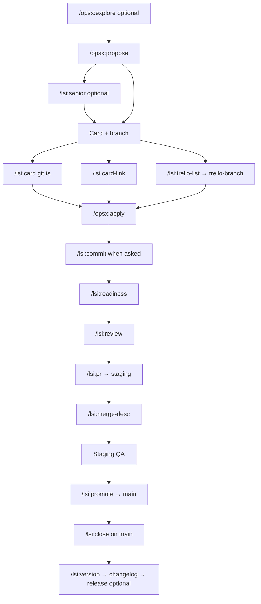

Interactive LSI workflow discovery — overview first, section menu until **Exit**. Read-only consultation; no implementation side effects.

**Canonical source:** [which-workflow.md](../../docs/workflows/which-workflow.md) · [openspec-git-integration.md](../../docs/workflows/openspec-git-integration.md)

**Help session — agent guardrails**

You are in a **`/lsi:help` session** until the user selects **Exit** from the section menu.

- **Stay in session:** treat follow-up turns as help navigation until Exit; do not end after one section.
- **Read-only:** no `git commit`, `git ts`, `git tb`, Trello API, `adopt.py`, or running other `/lsi:*` / `/opsx:*` from within help.
- **Suggest, don't run:** the `next` section names one command + rationale only — never auto-invoke it.
- **One section per turn:** full overview once at session start; then section content + menu only.
- **No dump:** never emit all sections, full lifecycle, command table, and SDLC diagram in one response.
- **Fresh session:** a new `/lsi:help` invocation starts over; prior session state does not carry over.
- **Menu fallback:** prefer AskQuestion; if unavailable, numbered list + reply with id (same menu ids; do not refuse).

**Input:** Optional topic — `lifecycle`, `sdlc`, `status`, `commands`, `policies`, `overlap`, `links`, `next`. With a topic: short overview + named section + mandatory menu.

**Steps**

1. Read `PROJECT.md` → `{ref}` = `v{BUNDLE_VERSION}` when present, else `main`.
2. Optional read-only: `git branch --show-current`, `openspec list --json`.
3. **Session start:** emit overview only (unless topic arg — then overview + that section).
4. **Section menu** — **AskQuestion** when available; otherwise numbered list + “reply with id”.
5. **Loop until Exit:** section → menu again; **Exit** → `Exited /lsi:help.` and stop.

**Follow-up text while in session**

- Unambiguous text (e.g. `policies`) → map to menu id → section → AskQuestion again.
- Ambiguous → AskQuestion menu (do not guess; do not exit).

---

## GitHub URL builder

All spec links in help output:

`https://github.com/osuarez1/cursor-dev-workflows/blob/{ref}/{bundle-path}`

Replace `{ref}` from step 1. Example:

`[senior-analysis.md](https://github.com/osuarez1/cursor-dev-workflows/blob/v1.4.1/docs/workflows/senior-analysis.md)`

**Bundle-path map**

| Label | bundle-path |
|-------|-------------|
| which-workflow.md | `overlays/lsi/docs/workflows/which-workflow.md` |
| openspec-git-integration.md | `overlays/lsi/docs/workflows/openspec-git-integration.md` |
| branch-workflow.md | `overlays/lsi/docs/workflows/branch-workflow.md` |
| git-trello.md | `overlays/lsi/docs/sdlc/git-trello.md` |
| ticket-card-info.md | `docs/workflows/ticket-card-info.md` |
| pull-requests.md | `docs/workflows/pull-requests.md` |
| pr-production-readiness.md | `docs/workflows/pr-production-readiness.md` |
| code-review.md | `docs/workflows/code-review.md` |
| senior-analysis.md | `docs/workflows/senior-analysis.md` |
| commits-logical-order.md | `docs/workflows/commits-logical-order.md` |
| versioning-and-releases.md | `overlays/lsi/docs/workflows/versioning-and-releases.md` |
| adopt-and-update.md | `docs/adopt-and-update.md` |
| common-mistakes.md | `docs/workflows/common-mistakes.md` |
| test-requirements.md | `docs/workflows/test-requirements.md` |
| integrations.md | `docs/workflows/integrations.md` |
| CONVENTION.commits.template | `overlays/lsi/agent-stack/CONVENTION.commits.template` |

Do **not** use relative `.lsi/workflows/` paths or adopter Bitbucket URLs in help output.

---

## Overview template (session start only)

```markdown
## LSI workflow overview

- **Dual ticketing:** OpenSpec + Trello (24-char branch id) — staging-first to `main`
- **Typical path:** propose → card/branch → apply → commit → readiness/review → PR → promote → close
- **Bundle:** [cursor-dev-workflows](https://github.com/osuarez1/cursor-dev-workflows) @ `{ref}`

Pick a section below, or Exit when done.
```

Optional one-line context hint (branch / phase) after the overview.

---

## AskQuestion menu

- **Prompt:** `What do you want to see? (Exit to leave help)`

| id | label |
|----|-------|
| `sdlc` | SDLC diagram |
| `lifecycle` | Full lifecycle (13 steps) |
| `status` | Where you are now |
| `commands` | Command reference by phase |
| `policies` | Key policies |
| `overlap` | Overlap rules and card paths |
| `links` | Deep dive spec links |
| `next` | Suggested next command |
| `exit` | Exit help |

After every section (except Exit): `Pick another section or Exit.` then AskQuestion.

---

## Section: `sdlc`

Emit **mermaid only** (no numbered lifecycle list):



Legend: dashed edge = optional platform release on `main`; do not sync/archive on staging merge only.

Link to [which-workflow.md](https://github.com/osuarez1/cursor-dev-workflows/blob/{ref}/overlays/lsi/docs/workflows/which-workflow.md) for **routing** flowchart (ambiguous requests — different from this SDLC diagram).

---

## Section: `lifecycle`

Numbered 1–13 (GitHub links inline):

1. `/opsx:explore` (optional) — clarify problem — [openspec-git-integration.md](https://github.com/osuarez1/cursor-dev-workflows/blob/{ref}/overlays/lsi/docs/workflows/openspec-git-integration.md)
2. `/opsx:propose <slug>` — proposal, design, tasks
3. `/lsi:senior` — when design is large — [senior-analysis.md](https://github.com/osuarez1/cursor-dev-workflows/blob/{ref}/docs/workflows/senior-analysis.md)
4. `/lsi:card` from **`main`** or **`staging`** — Trello card + ticket branch — [ticket-card-info.md](https://github.com/osuarez1/cursor-dev-workflows/blob/{ref}/docs/workflows/ticket-card-info.md)
5. `/opsx:apply` — implement `tasks.md`
6. [test-requirements.md](https://github.com/osuarez1/cursor-dev-workflows/blob/{ref}/docs/workflows/test-requirements.md) — while coding
7. `/lsi:commit` — when user asks — [commits-logical-order.md](https://github.com/osuarez1/cursor-dev-workflows/blob/{ref}/docs/workflows/commits-logical-order.md)
8. `/lsi:readiness` — before PR — [pr-production-readiness.md](https://github.com/osuarez1/cursor-dev-workflows/blob/{ref}/docs/workflows/pr-production-readiness.md)
9. `/lsi:review` — before merge — [code-review.md](https://github.com/osuarez1/cursor-dev-workflows/blob/{ref}/docs/workflows/code-review.md)
10. `/lsi:pr` — title and description; target **`staging`** — [pull-requests.md](https://github.com/osuarez1/cursor-dev-workflows/blob/{ref}/docs/workflows/pull-requests.md)
11. After staging merge — `/lsi:merge-desc`; **do not** sync or archive
12. `/lsi:promote` — after staging QA; target **`main`**
13. After main merge — `/lsi:close` on **`main`**

---

## Section: `status` and `next` — branch → phase → command

**Read-only inputs:** `git branch --show-current`, `openspec list --json`; optional `git status --short`, check `design.md` / unchecked `tasks.md`.

**Branch classification**

| Pattern | Match |
|---------|--------|
| Protected integration | `^(main\|staging)$` |
| Ticket-linked | `^(feature\|bugfix\|hotfix\|chore)/[a-f0-9]{24}-.+$` |
| Other | Non-ticket or legacy branch names |

Extract `{id}` and `{change-slug}` from ticket branch. Compare `{change-slug}` to active OpenSpec change when one is in progress.

**Phase → suggested command** (first matching row wins):

| Branch class | OpenSpec / signals | Phase label | Suggested command |
|--------------|-------------------|-------------|-------------------|
| Other | Active change; branch lacks 24-char id | Wrong branch | `/lsi:branch` — then `/lsi:card-link` if on feature work without id |
| Protected | No in-progress change | Pre-change | `/opsx:explore` (optional) or `/opsx:propose` |
| Protected | In-progress; `design.md` present; apply not started | Design review (optional) | `/lsi:senior` — then card setup |
| Protected | In-progress; ready for card | Card setup | `/lsi:card` from `main`/`staging` — or `/lsi:trello-list` → branch for existing card |
| Ticket | Suffix ≠ active change slug | Branch mismatch | `/lsi:branch` |
| Ticket | `tasks.md` has unchecked apply items | Implement | `/opsx:apply` |
| Ticket | Uncommitted changes; user likely committing | Commit | `/lsi:commit` (only when user asks to commit) |
| Ticket | Apply complete; pre-PR | Readiness | `/lsi:readiness` |
| Ticket | After readiness pass | Review | `/lsi:review` |
| Ticket | After review; ready to open PR | PR to staging | `/lsi:pr` |
| Protected `main` | Change still in-progress after staging (infer from context) | Promotion | `/lsi:promote` — **only when user context indicates staging QA passed** |
| Protected `main` | After production merge | Production close | `/lsi:close` |

**Ambiguity:** prefer earlier lifecycle step; when staging merge / promotion / close cannot be inferred, say **phase unclear** and suggest **`lifecycle`** or **`/lsi:branch`** — do not guess.

**`status` output:** branch class, active OpenSpec, inferred phase label, suggested next command + one-line why.

**`next` output:** one `/lsi:*` or `/opsx:*` + rationale only — **never invoke**.

**Conditional `TITLE_PREFIX` note (status only):** when suggested next step is card setup (`/lsi:card`, `/lsi:card-link`, `/lsi:trello-list` → branch), add: read `TITLE_PREFIX` from `PROJECT.md` for card titles; when absent, use `REPO_NAME |` per [ticket-card-info.md](https://github.com/osuarez1/cursor-dev-workflows/blob/{ref}/docs/workflows/ticket-card-info.md). Do **not** emit this note on other phases.

---

## Section: `commands`

| Phase | Command | Spec |
|-------|---------|------|
| Explore | `/opsx:explore` | [openspec-git-integration.md](https://github.com/osuarez1/cursor-dev-workflows/blob/{ref}/overlays/lsi/docs/workflows/openspec-git-integration.md) |
| Propose | `/opsx:propose` | [openspec-git-integration.md](https://github.com/osuarez1/cursor-dev-workflows/blob/{ref}/overlays/lsi/docs/workflows/openspec-git-integration.md) |
| Senior analysis | `/lsi:senior` | [senior-analysis.md](https://github.com/osuarez1/cursor-dev-workflows/blob/{ref}/docs/workflows/senior-analysis.md) |
| Card + branch | `/lsi:card` | [ticket-card-info.md](https://github.com/osuarez1/cursor-dev-workflows/blob/{ref}/docs/workflows/ticket-card-info.md) |
| Link existing branch | `/lsi:card-link` | [openspec-git-integration.md](https://github.com/osuarez1/cursor-dev-workflows/blob/{ref}/overlays/lsi/docs/workflows/openspec-git-integration.md) |
| List / branch from To Do | `/lsi:trello-list`, `/lsi:trello-branch` | [git-trello.md](https://github.com/osuarez1/cursor-dev-workflows/blob/{ref}/overlays/lsi/docs/sdlc/git-trello.md) |
| Branch verify | `/lsi:branch` | [branch-workflow.md](https://github.com/osuarez1/cursor-dev-workflows/blob/{ref}/overlays/lsi/docs/workflows/branch-workflow.md) |
| Implement | `/opsx:apply` | [openspec-git-integration.md](https://github.com/osuarez1/cursor-dev-workflows/blob/{ref}/overlays/lsi/docs/workflows/openspec-git-integration.md) |
| Commit | `/lsi:commit` | [commits-logical-order.md](https://github.com/osuarez1/cursor-dev-workflows/blob/{ref}/docs/workflows/commits-logical-order.md) |
| Readiness | `/lsi:readiness` | [pr-production-readiness.md](https://github.com/osuarez1/cursor-dev-workflows/blob/{ref}/docs/workflows/pr-production-readiness.md) |
| Review | `/lsi:review` | [code-review.md](https://github.com/osuarez1/cursor-dev-workflows/blob/{ref}/docs/workflows/code-review.md) |
| PR | `/lsi:pr` | [pull-requests.md](https://github.com/osuarez1/cursor-dev-workflows/blob/{ref}/docs/workflows/pull-requests.md) |
| Merge desc | `/lsi:merge-desc` | [openspec-git-integration.md](https://github.com/osuarez1/cursor-dev-workflows/blob/{ref}/overlays/lsi/docs/workflows/openspec-git-integration.md) |
| Promote | `/lsi:promote` | [pull-requests.md](https://github.com/osuarez1/cursor-dev-workflows/blob/{ref}/docs/workflows/pull-requests.md) |
| Close | `/lsi:close` | [openspec-git-integration.md](https://github.com/osuarez1/cursor-dev-workflows/blob/{ref}/overlays/lsi/docs/workflows/openspec-git-integration.md) |
| Release | `/lsi:version`, `/lsi:changelog`, `/lsi:release` | [versioning-and-releases.md](https://github.com/osuarez1/cursor-dev-workflows/blob/{ref}/overlays/lsi/docs/workflows/versioning-and-releases.md) |
| Re-sync bundle | `/lsi:update` | [adopt-and-update.md](https://github.com/osuarez1/cursor-dev-workflows/blob/{ref}/docs/adopt-and-update.md) |
| Workflow help | `/lsi:help` | [lsi-help.md](https://github.com/osuarez1/cursor-dev-workflows/blob/{ref}/overlays/lsi/agent-stack/commands/lsi-help.md) |

**OpenSpec:** `/opsx:sync`, `/opsx:archive` — on **`main`** only after promotion.

---

## Section: `policies`

- **Protected branches** — no task work on `main`/`staging` except card-setup commands — [branch-workflow.md](https://github.com/osuarez1/cursor-dev-workflows/blob/{ref}/overlays/lsi/docs/workflows/branch-workflow.md)
- **Ticket branch pattern** — `feature|bugfix|hotfix|chore/{24-char-id}-<change-slug>` — [openspec-git-integration.md](https://github.com/osuarez1/cursor-dev-workflows/blob/{ref}/overlays/lsi/docs/workflows/openspec-git-integration.md)
- **Staging-first PRs** — feature PRs target **`staging`**; promotion targets **`main`**
- **No sync/archive on staging merge** — keep change active until `/lsi:close` on **`main`**
- **Commit only when asked** — show plan first — [commits-logical-order.md](https://github.com/osuarez1/cursor-dev-workflows/blob/{ref}/docs/workflows/commits-logical-order.md)
- **Readiness before PR, review before merge** — [pr-production-readiness.md](https://github.com/osuarez1/cursor-dev-workflows/blob/{ref}/docs/workflows/pr-production-readiness.md), [code-review.md](https://github.com/osuarez1/cursor-dev-workflows/blob/{ref}/docs/workflows/code-review.md)
- **Card copy redacted** before Trello API — [git-trello.md](https://github.com/osuarez1/cursor-dev-workflows/blob/{ref}/overlays/lsi/docs/sdlc/git-trello.md)
- **Tests** — [test-requirements.md](https://github.com/osuarez1/cursor-dev-workflows/blob/{ref}/docs/workflows/test-requirements.md)

---

## Section: `overlap`

Summarize overlay [which-workflow.md](https://github.com/osuarez1/cursor-dev-workflows/blob/{ref}/overlays/lsi/docs/workflows/which-workflow.md) overlap rules:

1. **PR conventions vs readiness vs code review** — format vs checklist vs deep review; readiness before PR, review before merge.
2. **Senior analysis vs code review** — design alternatives ≠ security/performance gates; different verdict words.
3. **Ticket card vs implementation** — card drafting does not authorize coding on protected branches.
4. **`/lsi:card` vs `/lsi:card-link` vs trello commands** — new card (`git ts`) vs link existing vs picker → `git tb`.
5. **Commit plan vs commit execution** — plan first; `git commit` only when user asks.
6. **`tasks.md` vs production close** — `/opsx:apply` completes tasks only; `/lsi:close` on **`main`** after promotion.
7. **`/lsi:help` vs implementation commands** — read-only consultation until **Exit**; explains routing and may suggest the next command but does **not** run `/lsi:*`, `/opsx:*`, `git ts`/`git tb`, Trello API, `adopt.py`, or commits. When the user wants to **do** work, use the implementation command. After **Exit**, a fresh explicit slash invocation applies. Detail: [lsi-help.md](https://github.com/osuarez1/cursor-dev-workflows/blob/{ref}/overlays/lsi/agent-stack/commands/lsi-help.md).

---

## Section: `links`

Bullet list — all bundle-path map entries as GitHub blob links (use `{ref}` from step 1).

---

## Section: `exit`

Acknowledge briefly: `Exited /lsi:help.` Do not present the menu again.
