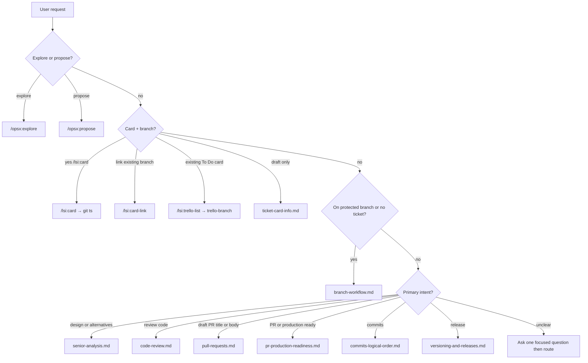

# Which workflow?

Use this routing guide when the user’s request could match more than one document.

Full OpenSpec + Git lifecycle: [openspec-git-integration.md](openspec-git-integration.md).

## Decision table

| User says (examples) | Use | Command | Output / verdict |
|----------------------|-----|---------|------------------|
| explore idea, think through change | [openspec-git-integration.md](openspec-git-integration.md) | `/opsx:explore` | Discussion; docs-only on protected branches |
| propose OpenSpec change | [openspec-git-integration.md](openspec-git-integration.md) | `/opsx:propose` | proposal, design, tasks |
| sync delta specs | [openspec-git-integration.md](openspec-git-integration.md) | `/opsx:sync` | Main specs updated |
| create Trello card and branch, `/lsi:card` | [openspec-git-integration.md](openspec-git-integration.md) | `/lsi:card` | Card + branch via `git ts` from `main`/`staging` |
| link Trello card to existing branch, `/lsi:card-link` | [openspec-git-integration.md](openspec-git-integration.md) | `/lsi:card-link` | Requires open OpenSpec; card body redacted from artifacts |
| list Trello To Do cards, `/lsi:trello-list` | [git-trello.md](../sdlc/git-trello.md) | `/lsi:trello-list` | Picker → confirm; requires OpenSpec to branch |
| branch from existing Trello card, `/lsi:trello-branch` | [git-trello.md](../sdlc/git-trello.md) | `/lsi:trello-branch` | Requires open OpenSpec; sync card then `git tb` |
| draft ticket card, task type/title/description (no CLI) | [ticket-card-info.md](ticket-card-info.md) | — | Three copy-paste blocks; use `/lsi:card` for card + branch |
| create branch, wrong branch, on main | [branch-workflow.md](branch-workflow.md) | `/lsi:branch` | Refuse or redirect to ticket branch |
| draft PR title, PR description, PR copy | [pull-requests.md](pull-requests.md) | `/lsi:pr` | Title + markdown body |
| production promotion PR (staging → main) | [openspec-git-integration.md](openspec-git-integration.md) | `/lsi:promote` | Promotion PR to `main` |
| production close (sync + archive on main) | [openspec-git-integration.md](openspec-git-integration.md) | `/lsi:close` | Close change after main merge |
| ready for PR, production ready, ship checklist | [pr-production-readiness.md](pr-production-readiness.md) | `/lsi:readiness` | Checklist + verdict |
| code review, review branch | [code-review.md](code-review.md) | `/lsi:review` | Summary + verdict |
| senior analysis, design alternatives | [senior-analysis.md](senior-analysis.md) | `/lsi:senior` | Full report + verdict |
| merge extended description (Bitbucket) | [openspec-git-integration.md](openspec-git-integration.md) | `/lsi:merge-desc` | Extended merge body |
| commit plan, logical commits | [commits-logical-order.md](commits-logical-order.md) | `/lsi:commit` | Commit plan; commit only if asked |
| version bump, changelog, release tag | [versioning-and-releases.md](versioning-and-releases.md) | `/lsi:version`, `/lsi:changelog`, `/lsi:release`, `/lsi:bootstrap-release` | Release train on `main` |
| re-sync bundle, adopt update, workflow update | [adopt-and-update.md](adopt-and-update.md) | `/lsi:update` | Re-sync adopted workflows from bundle |
| when are tests required | [test-requirements.md](test-requirements.md) | — | Policy |
| OpenSpec apply / archive | [openspec-git-integration.md](openspec-git-integration.md) | `/opsx:apply`, `/opsx:archive` | Archive on `main` only — see overlay |

## Overlap rules

1. **PR conventions vs readiness vs code review** — [pull-requests.md](pull-requests.md) defines title/body format. [pr-production-readiness.md](pr-production-readiness.md) is the readiness checklist and verdict. [code-review.md](code-review.md) walks logic, security, performance, and tests in depth. Run readiness **before** opening a PR; run code review before merge.
2. **Senior analysis vs code review** — Senior analysis explains design and alternatives; it does **not** replace security/performance/test gates. Use different verdict words (never `Ready` for senior analysis).
3. **Ticket card vs implementation** — Card drafting does not authorize coding on a protected branch. Use **`/lsi:card`** when the user wants card + branch from `main`/`staging`; use **`/lsi:card-link`** when work already exists on a branch without a Trello id; draft-only blocks when they want copy-paste fields only.
4. **`/lsi:card` vs `/lsi:card-link` vs trello commands vs `git ts`** — `/lsi:card` runs `git ts` (new branch). `/lsi:card-link` and trello flows require OpenSpec and redact card copy before Trello API. `/lsi:trello-list` is interactive picker → confirm → optional `git tb`. Never run raw `git ts` when linking an existing card.
5. **Commit plan vs commit execution** — Always show a plan before the first commit on a branch when multiple logical changes exist. Run `git commit` only when the user explicitly asks.
6. **`tasks.md` vs production close** — `/opsx:apply` completes `tasks.md` deliverables only. Do **not** add `/opsx:sync`, `/opsx:archive`, or `/lsi:close` as tasks; run `/lsi:close` on **`main`** after promotion.

## Flowchart

## Recommended order (large feature)

1. `/opsx:explore` (optional) — clarify problem  
2. `/opsx:propose <slug>` — proposal, design, tasks  
3. `/lsi:senior` — when design is large (FFmpeg, contracts, multi-module)  
4. `/lsi:card` from **`main`** or **`staging`** — Trello card + ticket branch  
5. `/opsx:apply` — implement `tasks.md`  
6. [test-requirements.md](test-requirements.md) — while coding  
7. `/lsi:commit` — when user asks  
8. `/lsi:readiness` — before PR  
9. `/lsi:review` — before merge  
10. `/lsi:pr` — title and description; target **`staging`**
11. After staging merge — `/lsi:merge-desc`; **do not** sync or archive
12. `/lsi:promote` — after staging QA; target **`main`**
13. After main merge — `/lsi:close` on **`main`**

## Related

- [PROJECT.md](../../PROJECT.md) — placeholders and adoption
- [openspec-git-integration.md](openspec-git-integration.md) — OpenSpec + Git overlay  
- [versioning-and-releases.md](versioning-and-releases.md) — release commands  
- [common-mistakes.md](common-mistakes.md) — confusing workflows  
