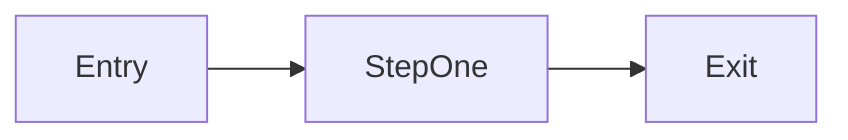

# Senior analysis — `<branch>` — `<YYYY-MM-DD>`

**Base:** `BASE_BRANCH...HEAD` (`<N>` commits)  
**Tier:** Deep | Light | Skip — `<why>`  
**Overall verdict:** Sound | Acceptable with follow-ups | Rethink

## Executive summary

<!-- 2–4 sentences: what the branch does, whether the design holds, main risks -->

## Logical changes overview

| ID | Title | Files / area | Unit verdict |
|----|-------|--------------|--------------|
| LC-1 | | | Sound / Acceptable with follow-ups / Rethink |
| LC-2 | | | |

---

## LC-1: `<title>`

### Intent and scope

- **Problem:**
- **Out of scope:**

### Before / after

| Dimension | Before (base) | After (branch) |
|-----------|---------------|----------------|
| Behavior | | |
| Data shape | | |
| Failure modes | | |

**Delta:**

### Flow (optional mermaid)

<!-- Delete or write "N/A — trivial" -->

### Alternatives

| Option | Pros | Cons |
|--------|------|------|
| A — chosen | | |
| B | | |
| C — do nothing / extend existing | | |

### Recommendation

<!-- Why the chosen approach fits this codebase -->

### Logical correctness notes

- Invariants:
- Edge cases:
- Failure / rollback:

### Cross-cutting impact

- 

### Unit verdict

`Sound` | `Acceptable with follow-ups` | `Rethink`

---

## Cross-cutting analysis

- Ordering / flags / deploy:

## Open questions

- 

## Suggested follow-ups

- 

## Relationship to code review

- Merge readiness (`Ready` / `Blocked`) is **not** this document’s verdict.
- Run [code-review.md](../code-review.md) before merge for security, performance, and tests.
