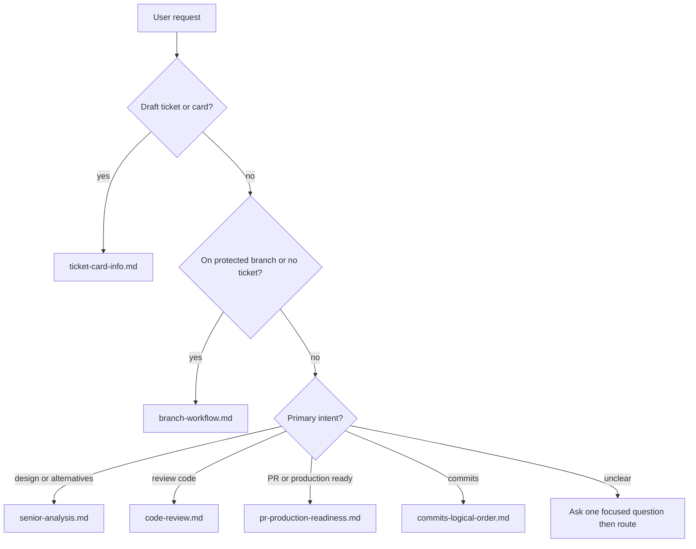

# Which workflow?

Use this routing guide when the user’s request could match more than one document.

## Decision table

| User says (examples) | Use | Output / verdict |
|----------------------|-----|------------------|
| draft ticket card, `git ts`, task type/title/description | [ticket-card-info.md](ticket-card-info.md) | Three copy-paste blocks |
| create branch, wrong branch, on main | [branch-workflow.md](branch-workflow.md) | Refuse or redirect to ticket branch |
| ready for PR, production ready, ship checklist, draft PR body | [pr-production-readiness.md](pr-production-readiness.md) | Checklist + `Ready` \| `Needs fixes` \| `Blocked` |
| code review, review branch, review locally | [code-review.md](code-review.md) | Summary, Critical, Suggestions, Tests; verdict `Ready` \| `Needs fixes` \| `Blocked` |
| senior analysis, design alternatives, before/after, LC-1 | [senior-analysis.md](senior-analysis.md) | Full report; verdict `Sound` \| `Acceptable with follow-ups` \| `Rethink` |
| commit plan, logical commits, commit message | [commits-logical-order.md](commits-logical-order.md) | Ordered commit plan; **commit only if asked** |
| when are tests required | [test-requirements.md](test-requirements.md) | Policy + exemption wording |
| log review to PR host or ticket tool | [integrations.md](integrations.md) | Optional adapters |
| what did the agent do wrong | [common-mistakes.md](common-mistakes.md) | Anti-patterns |

## Overlap rules

1. **PR readiness vs code review** — Readiness is a checklist and ship/no-ship summary. Code review walks logic, security, performance, and tests in depth. Run readiness before opening a PR; run code review before merge.
2. **Senior analysis vs code review** — Senior analysis explains design and alternatives; it does **not** replace security/performance/test gates. Use different verdict words (never `Ready` for senior analysis).
3. **Ticket card vs implementation** — Card drafting does not authorize coding on a protected branch. Branch + ticket first, then Agent mode work.
4. **Commit plan vs commit execution** — Always show a plan before the first commit on a branch when multiple logical changes exist. Run `git commit` only when the user explicitly asks.

## Flowchart

## Recommended order (large feature)

1. [ticket-card-info.md](ticket-card-info.md) — card fields  
2. [branch-workflow.md](branch-workflow.md) — ticket-linked branch  
3. Implementation (Agent mode)  
4. [senior-analysis.md](senior-analysis.md) — early, if design is non-trivial  
5. [test-requirements.md](test-requirements.md) — while coding  
6. [commits-logical-order.md](commits-logical-order.md) — plan, then commit when asked  
7. [pr-production-readiness.md](pr-production-readiness.md) — before opening PR  
8. [code-review.md](code-review.md) — before merge  

## Related

- [README.md](README.md) — placeholders and adoption  
- [common-mistakes.md](common-mistakes.md) — confusing workflows  
